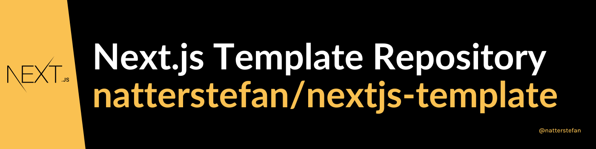

# nextjs-template

[](https://github.com/natterstefan/nextjs-template/actions/workflows/ci.yml)
[](https://github.com/natterstefan/nextjs-template/issues)
[](https://github.com/natterstefan/nextjs-template/stargazers)
[](https://github.com/natterstefan/nextjs-template/blob/main/LICENSE)
[](https://github.com/natterstefan/nextjs-template)



Ready to go template repository for your next Next.js application! 🚀

## Features

- ⭐️ [Next.js@10.x](https://nextjs.org/)
- ⭐️ [Tailwind@2.x](https://tailwindcss.com)
- ⭐️ [Jest](https://jestjs.io/)
- ⭐️ [Storybook](https://storybook.js.org/)
- ⭐️ [ESLint](https://eslint.org/) and [Prettier](https://prettier.io/)
- ⭐️ [Docker](https://www.docker.com/)
- ⭐️ [i18n](https://www.i18next.com/)
- ⭐️ [Cypress](https://www.cypress.io/)
- ⭐️ One-Click deployment to [Vercel](https://vercel.co/)

## Requirements

Following tools are required:

- [Node.js](https://nodejs.org/)
- [Yarn](https://yarnpkg.com/)
- [Docker](https://docker.com)
- [Java](https://openjdk.java.net/)
- Optimized for [Visual Studio Code](https://code.visualstudio.com/)

For easy version management of the requirements above, we recommend using
[asdf](https://asdf-vm.com/). It will automatically use the nailed versions (see
[tools-version](.tool-versions)). For Docker and Java we recommend the latest
available versions.

## Installation & Setup

```bash
./gradlew dev
```

Once the task is completed you can start the app with `yarn dev`.

## Start

```bash
# development mode
yarn dev

# production mode
yarn build
yarn start
```

### Probe Status `/api/probe-status`

The server comes with a Probe Status HTTP endpoint to test if app is running.

### Version `/api/version`

The server comes with a Version HTTP endpoint to see which version is running.

## Development

### Tests & Code Style

```bash
yarn test
yarn lint
```

## Deployment

### Deploy your own

Deploy `nextjs-template` using [Vercel](https://vercel.com):

[](https://vercel.com/import/project?template=https://github.com/natterstefan/nextjs-template)

### Docker

`nextjs-template` also provides a Docker Image (see [docker](./docker)) and
docker-compose setup.

#### Build Docker Image

```bash
./gradlew buildDockerImage
```

#### Run Docker Image

```bash
./gradlew runDockerBuild
```

Or when you want to run it in the background:

```bash
docker-compose --env-file ./.env.local up -d
```

## References

- based on <https://github.com/vercel/next.js/tree/master/examples/with-tailwindcss>

## License

[MIT](./LICENSE)

## Contributors ✨

Thanks goes to these wonderful people ([emoji key](https://allcontributors.org/docs/en/emoji-key)):

<!-- ALL-CONTRIBUTORS-LIST:START - Do not remove or modify this section -->
<!-- prettier-ignore-start -->
<!-- markdownlint-disable -->
<table>
  <tr>
    <td align="center"><a href="https://natterstefan.me/"><br /><sub><b>Stefan Natter</b></sub></a><br /><a href="#ideas-natterstefan" title="Ideas, Planning, & Feedback">🤔</a></td>
  </tr>
</table>

<!-- markdownlint-restore -->
<!-- prettier-ignore-end -->

<!-- ALL-CONTRIBUTORS-LIST:END -->

This project follows the [all-contributors](https://github.com/all-contributors/all-contributors) specification. Contributions of any kind welcome!